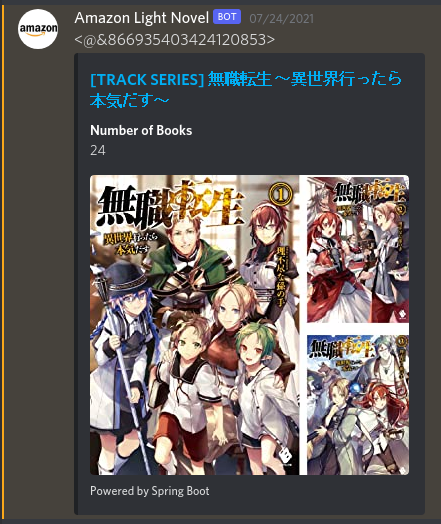
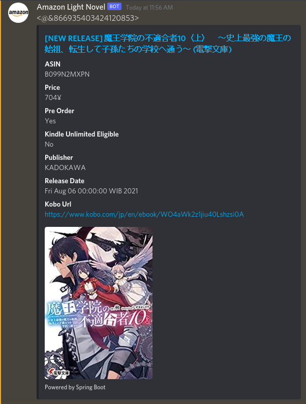
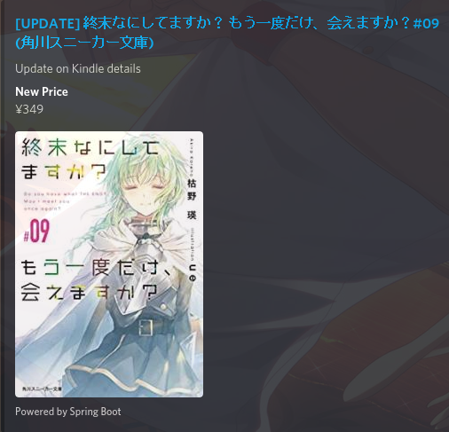

# Amazon Light Novel Tracker

## About

This program is used to track light novel release from amazon.co.jp such as new volume release and update on novel price, preorder and kindle unlimited eligible status and notify it to discord webhooks

## Installation

Simply import the project (maven) and for discord-webhook dependency manually build the package and register it to maven local repository from 

https://github.com/MinnDevelopment/discord-webhooks

## Discord Webhook Embed Example

### Tracking new series

### New volume released

### Update on volume

